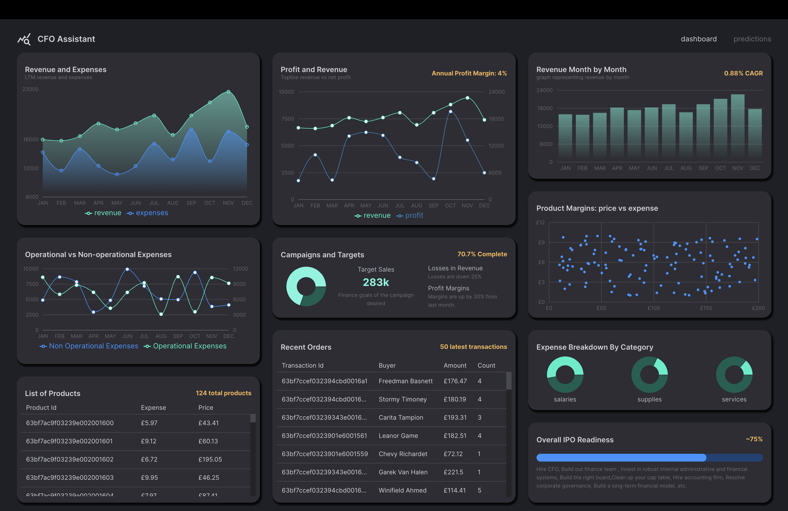
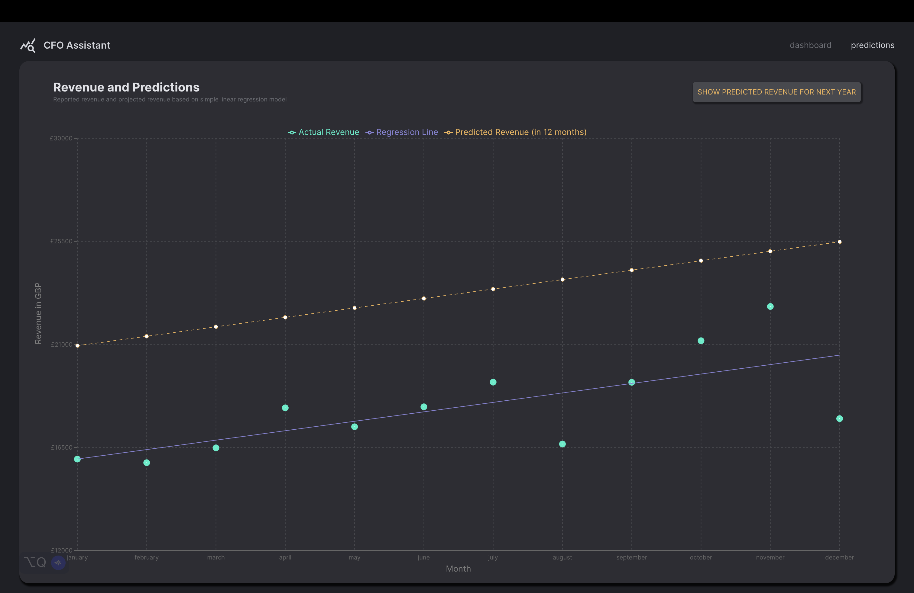
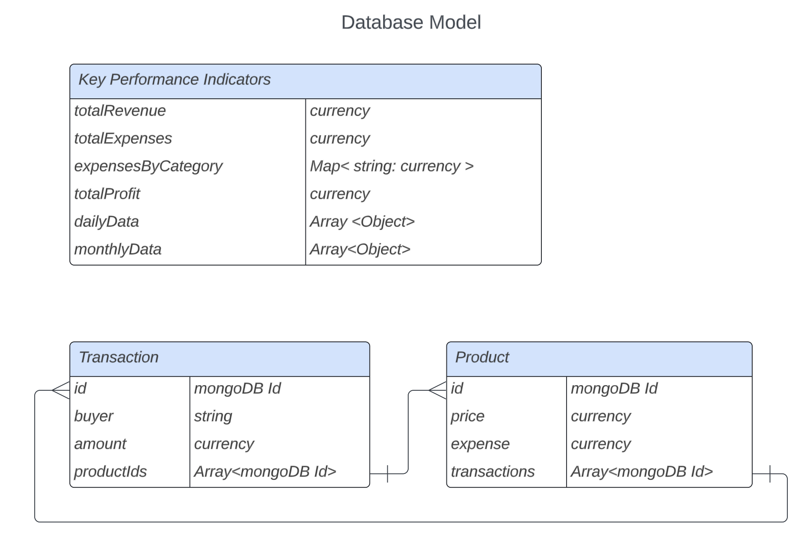

<h1 align="center">
  <br>
  
  <br>
  CFO Assistant
</h1>

<h4 align="center">A financial data visualisation and revenue projection tool. </h4>
<br>
<p align="center">
  
  
  
  
  
  
  
  
</p>
<br>

CFO Assistant is a full-stack app to help visualise and track a company's relevant financial KPIs as well as project its future revenue. As an [ex-finance professional](https://www.linkedin.com/in/alastairchau/), I had always wanted a more user-friendly way to visualise financial data other than Excel charts and graphs. (No offence to Excel... still think it's an amazing tool!)

This app was also built as a way for me to learn how to handle and display data using charts and graphs as well as become more comfortable with TypeScript and database design.

### Features

- A responsive layout  scatter plots, line graphs, tables, and pie charts to visualise financial data and KPIs.
- Tab to project next year's revenue using a [simple linear regression library](https://github.com/tom-alexander/regression-js) based on current year revenue data.
- Responsive layout that adjusts to screensize and shows more information when hovering over data points.


<br>


### Tech

Front end
- [TypeScript](https://www.typescriptlang.org/) language
- [Vite](https://vitejs.dev/) used for a starter app development tool
- [Recharts](https://recharts.org/en-US) for chart library
- [Redux Toolkit](https://redux-toolkit.js.org/) for state management
- [Redux Toolkit Query](https://redux-toolkit.js.org/rtk-query/overview) for API calls
- [React Router](https://reactrouter.com/en/main) for page navigation
- [Material UI](https://mui.com/material-ui/getting-started/overview/) for React component library
- [Material UI DataGrid](https://mui.com/x/api/data-grid/data-grid/) for tables

Back end
- [Node.js](https://nodejs.org/en) runtime environment
- [Express.js](https://expressjs.com/) framework

Database
- [MongoDB Atlas](https://www.mongodb.com/atlas/database)

Regression library
- Predictions are made with [regression-js](https://github.com/tom-alexander/regression-js) library

### Database design



### Running the app

Clone this repo:
```
git clone https://github.com/alastair10/cfo-assistant
```
Install dependencies and launch dev server on the `client`... 
```
cd client
npm install
npm run dev
```
... and now on the `server` side:
```
cd server
npm install
npm run dev
```

Open [http://localhost:5173](http://localhost:5173) to launch the app in your browser.

The app requires a MongoDB Atlas database. Create a `.env` file in your `server` directory with the appropriate connection string to your MongoDB account.

To use sample seed data, run the following code in the `index.js` file:

```js
const PORT = process.env.PORT || 9000;
mongoose
  .connect(process.env.MONGO_URL, {
    useNewUrlParser: true,
    useUnifiedTopology: true,
  })
  .then(async () => {
    app.listen(PORT, () => console.log(`Running on server Port: ${PORT}`));

    // Run once to seed data, then delete
    await mongoose.connection.db.dropDatabase();
    KPI.insertMany(kpis);
    Product.insertMany(products);
    Transaction.insertMany(transactions);
  })
  .catch((error) => console.log(`${error} did not connect.`));
```
